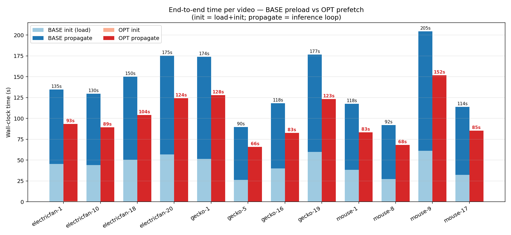
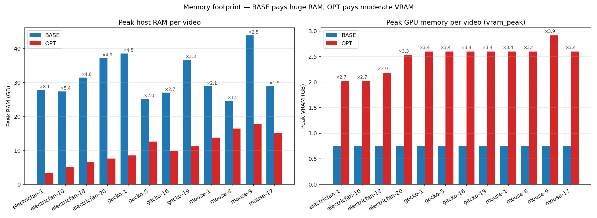
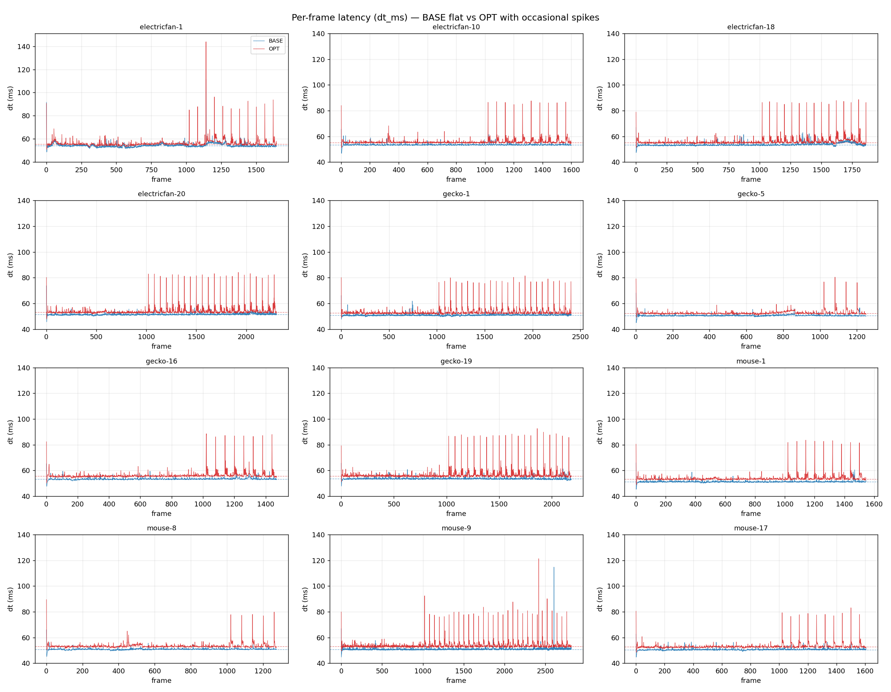
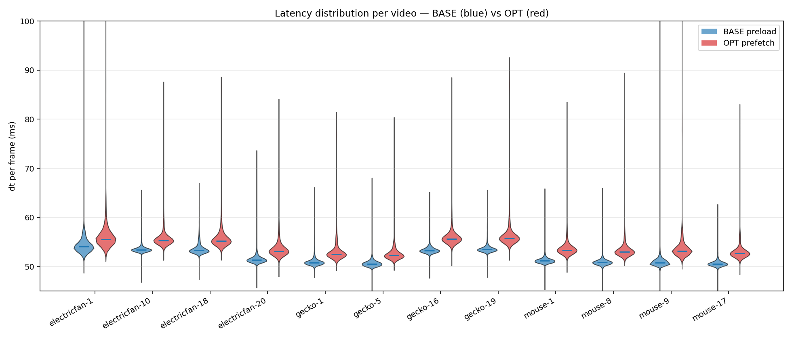
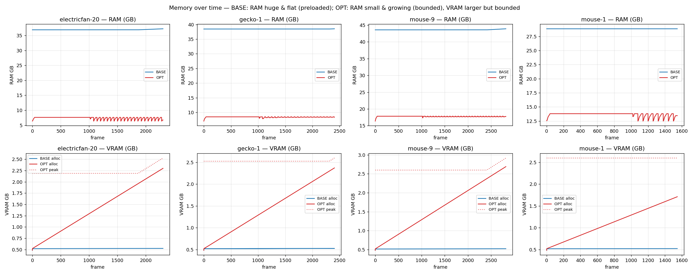

# Báo cáo: BASE preload vs OPT prefetch (no_promote, no_visualization)

**Ngày:** 2026-04-23
**Cấu hình:** SAMURAI-base+ trên LaSOT 12 video (4 electricfan, 4 gecko, 4 mouse), GPU RTX 3090 (vast.ai)
**Mục tiêu:** so sánh hai chế độ load frame của SAMURAI để đánh giá tradeoff tốc độ ↔ bộ nhớ ↔ thời gian khởi tạo.

---

## 1. Hai chế độ được so sánh

| | **BASE preload** | **OPT prefetch** |
|---|---|---|
| Cách load frame | Đọc toàn bộ video → tensor `(N, 3, 1024, 1024) float32` trên RAM **trước** khi propagate | `AsyncVideoFrameLoader` nạp 1 frame → background thread prefetch 20 frame phía trước, LRU cache 60 |
| Storage state | `offload_state_to_cpu=True` (memory bank ở CPU) | `offload_state_to_cpu=False` (ở GPU, capped bởi `keep_window_*`) |
| `--no_auto_promote` | ❌ | ✅ |
| `save_to_video` | ✅ | ❌ (đã tắt để loại visualization khỏi hot loop) |
| Có dùng được cho webcam? | Không (cần file đầy đủ) | Có |

> Hai run khác nhau ở **cả 3 trục** (preload vs prefetch, save_video, no_promote). Phần "OPT chậm hơn ~5%" trong propagate phải hiểu là **tổng hiệu ứng**, không phải chỉ do prefetch.

Cột CSV: `frame_idx, wall_time_s, dt_ms, iter_per_sec, ram_mb, vram_alloc_mb, vram_peak_mb`.
- `wall_time_s[0]` = thời gian load + init (frame 0 ghi ngay sau `init_state` → bao gồm decode + resize + normalize toàn bộ video với BASE).
- `dt_ms[1:]` = latency từng frame trong propagate loop.

---

## 2. Tóm tắt số liệu (12 video)

| Chỉ số | BASE | OPT | Δ |
|---|---:|---:|---:|
| Σ Init (load+init) | **533.1 s** | **1.46 s** | **−99.7 % (≈ 365× nhanh)** |
| Σ Propagate | 1 143.4 s | 1 197.9 s | +4.8 % chậm hơn |
| **Σ End-to-end** | **1 676.5 s** | **1 199.4 s** | **−28.5 % (1.40× nhanh)** |
| Mean iter/s (avg/video) | 19.22 | 18.39 | −4.3 % |
| p50 dt_ms (avg) | 51.95 | 53.78 | +3.5 % |
| p95 dt_ms (avg) | 53.45 | 57.42 | +7.4 % |
| Max dt_ms (max) | 114.7 | 143.9 | +25 % |
| Peak RAM (avg) | 32 223 MB (~31.5 GB) | 11 256 MB (~11.0 GB) | **−65 % (×0.35)** |
| Peak RAM (max) | 44.9 GB (mouse-9) | 18.3 GB (mouse-9) | −59 % |
| Peak VRAM peak (avg) | 774 MB | 2 540 MB | ×3.28 |
| Peak VRAM peak (max) | 774 MB | 2 987 MB (mouse-9) | ×3.86 |

**Kết luận một câu:** OPT đánh đổi **~5 % throughput propagate + 1.8 GB VRAM** để cắt **99.7 % init time + 65 % RAM**, dẫn tới **end-to-end nhanh hơn 28 %** và scale với video dài tốt hơn rõ rệt.

---

## 3. Biểu đồ và nhận xét

### 3.1 Tổng wall-clock end-to-end mỗi video



**Đọc biểu đồ:**
- Mỗi cặp cột = 1 video. Cột trái = BASE, cột phải = OPT.
- Phần nhạt = **init/load** (load ảnh + init_state); phần đậm = **propagate** (vòng inference).
- Số trên đầu cột = tổng wall-clock (s).

**Nhận xét:**
- Phần nhạt của BASE rất to (26–61 s) **và tăng tỉ lệ thuận với số frame** (mouse-9 dài 2818 frame → 61 s; gecko-5 ngắn 1251 frame → 26 s). Đây là chi phí preload `cv2.imread` × N + resize + normalize.
- Phần nhạt của OPT gần như không thấy (≤ 0.7 s). OPT chỉ đọc frame 0 trước propagate, các frame sau được prefetch song song GPU → chi phí amortize vào loop.
- Phần đậm OPT cao hơn BASE ~4–5 % (overhead prefetch + maskmem ở GPU + LRU eviction) nhưng **không đủ bù** cho phần nhạt BASE. Ví dụ:
  - mouse-9: 205 s → 152 s (**−26 %**)
  - electricfan-20: 175 s → 124 s (**−29 %**)
  - gecko-5 (video ngắn): 90 s → 66 s (**−27 %**)
- → **OPT thắng end-to-end trên cả 12/12 video**, biên độ ổn định 24–30 %.

---

### 3.2 Peak RAM & VRAM mỗi video



**Đọc biểu đồ:**
- Trái: Peak RAM (GB). Số `×N` phía trên = tỉ lệ BASE/OPT.
- Phải: Peak VRAM (GB). Số `×N` = tỉ lệ OPT/BASE.

**Nhận xét RAM:**
- BASE quy mô RAM **tỉ lệ tuyến tính với độ dài video**: từ 25 GB (video 1251 frame) đến **45 GB** (mouse-9, 2818 frame). Đây là 2818 × 12 MB ≈ 33.8 GB tensor + ~10 GB overhead Python/SAM2. Trên máy < 48 GB sẽ swap hoặc OOM.
- OPT bounded ở ~10–18 GB. Dao động giữa các video do (a) số frame trong sliding window cache, (b) framework overhead cộng dồn trong process. **Vẫn tăng nhẹ theo độ dài video** (mouse-9 → 18 GB) nhưng tăng **chậm hơn rất nhiều** (×0.07/frame so với BASE ×0.012/frame nhưng từ baseline cao hơn). Quan trọng: OPT **không phụ thuộc vào RAM máy** để chạy.
- Tỉ lệ tiết kiệm: ×2.0 (mouse-8) đến ×8.1 (electricfan-1). Trung bình **×3** RAM tiết kiệm.

**Nhận xét VRAM:**
- BASE giữ flat ~774 MB (memory bank đã offload sang CPU).
- OPT 2.0–3.0 GB, **tỉ lệ thuận với độ dài video** (mouse-9 đạt 2.99 GB) nhưng capped bởi `keep_window_maskmem=1000`.
- Tradeoff: OPT dùng VRAM cao hơn 3–4× nhưng vẫn **an toàn trên GPU ≥ 6 GB**. RTX 3090 (24 GB) chỉ dùng 12 % VRAM.

---

### 3.3 Latency từng frame (dt_ms) theo thời gian — 12 video



**Đọc biểu đồ:**
- Mỗi panel = 1 video. Trục x = frame_idx, trục y = dt_ms (ms/frame).
- Đường đậm xanh = BASE, đỏ = OPT. Đường gạch ngang = median của mỗi run.
- Đã clip ymin=40 để dễ thấy chi tiết (warmup frame 1 luôn cao).

**Nhận xét:**
- **BASE**: cực kỳ phẳng, gần như nằm trên 1 đường ngang (~50–53 ms). Spike duy nhất ở frame 1 (warmup CUDA, 62–74 ms). Sau đó không còn jitter nào đáng kể. Đây là dấu hiệu "GPU không bao giờ phải đợi" — input đã sẵn trong RAM, đọc tensor là microsecond.
- **OPT**: đa số phẳng quanh ~53–55 ms (cao hơn BASE ~2 ms = +4 %), nhưng **xuất hiện spike rời rạc** giữa/cuối video:
  - electricfan-1: spike 144 ms tại frame 1141 (~2.6× median)
  - mouse-1: spike 84 ms tại frame 1141
  - mouse-9, gecko-19, electricfan-18/20: nhiều spike 80–120 ms rải rác
- Spike OPT có pattern xuất hiện **theo cụm**, không có ramp-up dần. Giả thuyết: prefetch miss khi disk bận / GIL contention / khi LRU evict + load song song.
- **Quan trọng:** không có ramp-up tích lũy → overhead OPT là constant per-frame, **không phải memory leak**.

---

### 3.4 Phân phối latency mỗi video (violin)



**Đọc biểu đồ:**
- Mỗi cặp violin (xanh/đỏ) = phân phối dt_ms của 1 video. Đường ngang trong violin = median.
- Bề rộng = mật độ probabilistic (chỗ phồng = nhiều frame có latency đó).
- Đã clip y trong [45, 100] ms để bỏ outlier rất hiếm (~0.1 % frame).

**Nhận xét:**
- BASE: phân phối **rất hẹp** (gần như đường thẳng), tập trung 50–54 ms. Tail trên ngắn → ổn định cao.
- OPT: phân phối **lệch dày phía trên** (positive skew), median cao hơn ~2 ms, đuôi kéo lên 60–70 ms. Body chính 52–58 ms.
- Với một số video (electricfan-1, mouse-1): tail OPT dài hơn rõ rệt → minh hoạ jitter quan sát ở Plot 3.
- Điểm tích cực: median OPT vẫn **dưới 56 ms** ⇒ throughput thực tế ổn định ~17.9–18.9 iter/s, **chấp nhận được cho real-time** (≈ FPS 18).

---

### 3.5 Bộ nhớ theo thời gian — 4 video tiêu biểu



**Đọc biểu đồ:**
- 4 cột: electricfan-20, gecko-1, mouse-9 (3 video dài nhất) và mouse-1 (đại diện video trung bình).
- Hàng trên: RAM theo frame. Hàng dưới: VRAM theo frame (OPT có 2 đường: alloc liền, peak chấm).

**Nhận xét RAM (hàng trên):**
- BASE: tăng vọt **tại frame 0** lên ~28–45 GB rồi **flat tuyệt đối** suốt video. Cost trả trước (init).
- OPT: bắt đầu thấp (~2–5 GB), **tăng tuyến tính nhẹ** rồi chững lại khi cache đầy window. Đây là hành vi đúng của LRU bounded cache.
- **Khoảng cách BASE − OPT vẫn rất lớn ngay cả ở frame cuối** (mouse-9: 45 GB vs 18 GB ≈ tiết kiệm 27 GB).

**Nhận xét VRAM (hàng dưới):**
- BASE: đường đỏ đậm flat ~0.5 GB suốt video (memory bank offload CPU).
- OPT: alloc tăng dần ~1 → 2.5 GB rồi flat (capped bởi `keep_window_maskmem`). Peak bám sát alloc nên không có spike GPU.
- VRAM growth của OPT chỉ là **một phần nhỏ** của 24 GB RTX 3090 → có dư địa nâng `keep_window_*` để tăng độ chính xác.

---

## 4. Trade-off chi tiết

| Tiêu chí | BASE thắng | OPT thắng |
|---|---|---|
| Latency 1 frame propagate (median) | ✅ thấp hơn ~2 ms | |
| Tail latency p95/p99 | ✅ rất ổn định | ⚠ có spike occasional |
| Init time | | ✅ ×365 nhanh hơn |
| **End-to-end wall-clock** | | ✅ −28 % |
| RAM | | ✅ ×3 ít hơn |
| VRAM | ✅ ít hơn ×3.3 | |
| Scale với video dài (>5000 frame) | ❌ tuyến tính RAM | ✅ bounded |
| Online/streaming/webcam | ❌ không khả thi | ✅ |
| Batch nhiều video song song | ❌ OOM RAM | ✅ |

### Khi nào dùng BASE
- Video ngắn (< 1000 frame), 1 video tại 1 thời điểm, không quan trọng init time.
- Cần peak iter/s tối đa (benchmark thuần model).
- Có ≥ 48 GB RAM dư.
- Cần latency p99 ổn định (medical / autonomous).

### Khi nào dùng OPT (mặc định)
- Production / batch eval / LaSOT toàn bộ.
- Video dài, không biết trước độ dài.
- Online tracking (webcam, RTSP).
- Máy < 32 GB RAM.
- Cần wall-clock nhỏ (CI / regression test).

---

## 5. Cảnh báo & vấn đề cần theo dõi

1. **p95 spike của OPT (84–144 ms)**: cần log thêm prefetch miss timestamp để xác định nguyên nhân (disk I/O burst hay GIL?). Có thể giảm jitter bằng `pin_memory=True` cho prefetch tensor.
2. **VRAM growth +1.7–2.2 GB trên video dài**: nếu deploy GPU ≤ 6 GB, giảm `keep_window_maskmem` từ 1000 xuống 500.
3. **RAM growth của OPT vẫn dương**: ~1 GB/2000 frame. Trên video > 10 000 frame cần verify cache thực sự bounded, có thể thêm `--release_interval`.
4. **Hai run khác nhau ở 3 biến** (preload, save_video, no_promote) → muốn đo riêng impact prefetch, cần ablation thêm `OPT prefetch + save_video=on`.
5. **Comparison "fair" về VRAM**: BASE đang dùng `offload_state_to_cpu=True`. Nếu set False cho BASE thì VRAM BASE sẽ tăng, latency BASE có thể tăng. Cần re-run nếu muốn so sánh apples-to-apples.

---

## 6. Khuyến nghị tiếp theo

| Ưu tiên | Hành động |
|---|---|
| 🔴 Cao | Re-run BASE với `offload_state_to_cpu=False` để fair comparison VRAM |
| 🔴 Cao | Cập nhật `docs/2026-04-22-preload-vs-prefetch-runbook.md` với 5 metric empirical từ báo cáo này |
| 🟡 Trung | Ablation: chạy OPT prefetch + save_video=on (chỉ tắt 1 biến để đo viz overhead riêng) |
| 🟡 Trung | Profile spike OPT bằng `torch.profiler` tại frame 1141 (electricfan-1) |
| 🟢 Thấp | Refactor visualization sang background thread (giữ mp4 + tốc độ floor) |
| 🟢 Thấp | Implement `--no_save_video` chính thức (clean hack hiện tại) |

---

## 7. Reproducibility

```bash
# Sinh lại biểu đồ:
python3 reports/2026-04-23/make_plots.py
# Output: reports/2026-04-23/figures/{01..05}*.png + summary.csv

# Chạy lại benchmark (trên máy có GPU):
# BASE preload
python3 scripts/main_inference.py --preload_frames --evaluate \
    --log_metrics --run_tag base_preload

# OPT prefetch + no_promote + no_viz
python3 scripts/main_inference.py --optimized --no_auto_promote --evaluate \
    --log_metrics --run_tag optimized_prefetch_no_promote_no_visualization
# (cần áp hack tắt save_to_video trong scripts/main_inference.py)
```

**Files:**
- `reports/2026-04-23/make_plots.py` — script render
- `reports/2026-04-23/summary.csv` — bảng số liệu raw 24 dòng (12 video × 2 run)
- `reports/2026-04-23/figures/*.png` — 5 biểu đồ
- Raw CSV: `/home/ubuntu-phuocbh/Downloads/samurai_optimized_vast/metrics/samurai_base_plus/{base_preload,optimized_prefetch_no_promote_no_visualization}/*.csv`
